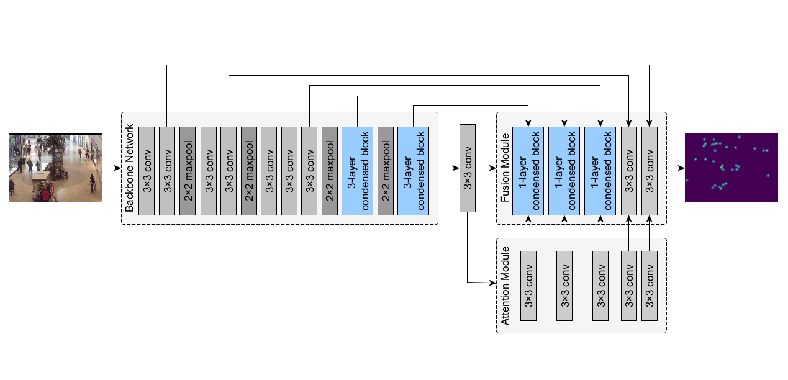
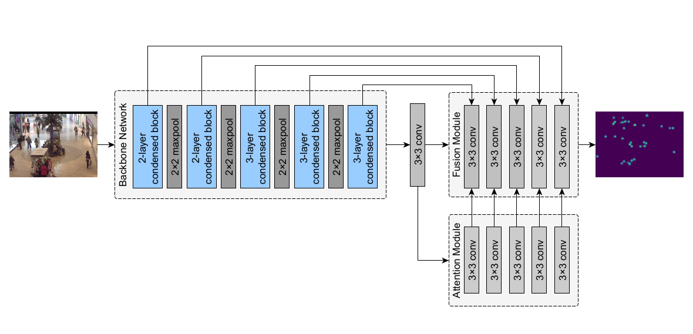

# Condensed Network (ConNet)

Condensed Network (ConNet) is a fast, efficient, and robust crowd counting model. It has two configurations: ConNet-04 with 447k parameters and ConNet-08 with 869k parameters. The architecture of both configurations are as shown below.


**Figure 1.** Architecture of ConNet-04


**Figure 2.** Architecture of ConNet-08

ConNet has been evaluated on the Mall and MICC datasets. In the table below, we show the results of ConNet, as well as CSRNet and MARUNet.

| **Dataset**   | **Model**         | **Parameters**    | **MAE**   | **MSE**   | **Weights**   |
|-------------  |------------------ |---------------:   |--------:  |--------:  |:-------------:|
| Mall          | CSRNet            |     16,263,489    |  1.961    |  2.494    | [GDrive](https://drive.google.com/file/d/1KXkhSiBn16LX3Tj3SaCrC1xL0YctJ_DV/view?usp=sharing)|
|               | MARUNet           |     27,271,627    |  1.810    |  2.319    | [GDrive](https://drive.google.com/file/d/11XtEWtQrBrYMqdlqWi7EIqbCIIqSv7Jh/view?usp=sharing)|
|               | ConNet-04 (Ours)  |        447,075    |  1.914    |  2.425    | [GDrive](https://drive.google.com/file/d/1t1-uP3ZYvUXGnZAYrlAj2W3lKmopntfC/view?usp=sharing)|
| MICC          | CSRNet            |     16,263,489    |  0.291    |  0.404    | [GDrive](https://drive.google.com/file/d/1HhPqukhEzzJID-ywvFzRZzID4WYJKuxa/view?usp=sharing)|
|               | MARUNet           |     27,271,627    |  0.138    |  0.240    | [GDrive](https://drive.google.com/file/d/1yw1bv0y_mlR0HgE_th2Rxii60m4NHMHk/view?usp=sharing)|
|               | ConNet-08 (Ours)  |        869,026    |  0.217    |  0.389    | [GDrive](https://drive.google.com/file/d/1lVJS67sDxAsjwoPfjikxEvDPvU9iCPif/view?usp=sharing)|


---

This repository also implements the following crowd counting models and model compression techniques:
- \[ [Paper](https://www.cv-foundation.org/openaccess/content_cvpr_2016/papers/Zhang_Single-Image_Crowd_Counting_CVPR_2016_paper.pdf) | [Code](https://github.com/svishwa/crowdcount-mcnn) \] Multi-Column Neural Network (MCNN)
- \[ [Paper](https://arxiv.org/abs/1802.10062) | [Code](https://github.com/leeyeehoo/CSRNet-pytorch) \] Congested Scene Recognition Network (CSRNet)
- \[ [Paper](https://openaccess.thecvf.com/content/WACV2021/html/Rong_Coarse-_and_Fine-Grained_Attention_Network_With_Background-Aware_Loss_for_Crowd_WACV_2021_paper.html) | [Code](https://github.com/rongliangzi/MARUNet) \] Multi-level Attention Refined UNet (MARUNet)
- \[ [Paper](https://openaccess.thecvf.com/content_ICCVW_2019/html/LPCV/Gusak_Automated_Multi-Stage_Compression_of_Neural_Networks_ICCVW_2019_paper.html) | [Code](https://github.com/musco-ai/musco-pytorch/) \] Multi-stage Compression (MUSCO)
- \[ [Paper](https://arxiv.org/abs/2003.10120) | [Code](https://github.com/HCPLab-SYSU/SKT) \] Structured Knowledge Transfer (SKT)

## Contents

- [Training / Validating / Testing](#training--validating--testing)
    - [Options](#options)
        - [Dataset Options](#dataset-options)
        - [Training Options](#training-options)
        - [Testing Options](#testing-options)
- [Compressing](#compressing)
    - [Compression Options](#compression-options)
    - [MUSCO Options](#musco-options)
    - [SKT Options](#skt-options)
## Training / Validating / Testing

To begin training, run main.py on the command line. If validating or testing, specify the `--mode` as shown in the options listed below (e.g. `python main.py --mode val`).

```
python main.py [OPTIONS] [--]
```

Further details can be specified through the options. Alternatively, these options can be directly modified on the `main.py` file. The next subsection lists down all other options that can be specified in this manner.

### Options

    --mode [STR]                        Mode of execution.
                                        Options: train, val, test, pred

#### Dataset Options
    --dataset [STR]                     Dataset to be used for training / testing.
                                        Options: micc, mall
    
    --dataset_subcategory [STR]         (If the chosen dataset is MICC) dataset sequence to be  
                                        used for training / testing. Default: all
                                        Options:  all, flow, groups, queue

#### Training Options 
    --lr [FLOAT]                        Learning rate to be used during training.
    --num_epochs [INT]                  Number of epochs to train.

    --model [STR]                       CNN model to use.
                                        Options: ConNet_04, ConNet_08, CSRNet, MCNN, MARUNet

    --pretrained_model [STR]            File path to pretrained model's weights (.pth or 
                                        .pth.tar file). Default: None

    --use_gpu [BOOLEAN]                 Toggles the use of GPU.
    --loss_log_step [INT]               Logs the loss every N epochs trained. Default: 1
    --model_save_step [INT]             Saves the weights every N epochs trained. Default: 1

#### Testing Options 

    --save_output_plots [BOOL]          Toggles the exporting of side-by-side comparison of
                                        groundtruth and output density maps during test/val

## Compressing

To compress an existing model, run main.py with the `--use_compress` option set to True. Failure to do so will run the program in training mode.

    python main.py --use_compress True [OPTIONS]

Similarly, these options can be directly modified on the `main.py` file.

### Compression Options 

The compression technique to be used can be specified through the `--compression` option. Further options regarding technique-specific details can be seen in the following subsections.

    --compression [STR]                 Compression technique to use.
                                        Options: musco, skt 
    
#### MUSCO Options 

    --musco_layers_to_compress [STR]    Specific layers to be compressed, separated by comma.
                                        Ex: `frontend.0,frontend.1,frontend.2`. Default: None
                                        If None, all eligible layers for compression will be
                                        selected
    --musco_ft_every [INT]              Number of layers to compress at each compression step.
    --musco_iters [INT]                 Number of times to compress each layer.
    --musco_ft_epochs [INT]             Number of epochs to train during each fine-tuning step.
    --musco_ft_checkpoint [INT]         Checks validation MAE/MSE every N fine-tuning epochs.

#### SKT Options

    --skt_student_chkpt [STR]           File path to student model's weights to continue training
                                        (.pth.tar file). Default: None
    --skt_num_epochs [INT]              Number of epochs to train the student model. Default: 1000
    --skt_lamb_fsp [INT]                Weight of the summation of MSE loss between teacher and 
                                        student features. Default: 0.5
    --skt_lamb_cos [INT]                Weight of the summation of cross entropy loss between
                                        teacher and student features. Default: 0.5
    --skt_print_freq [INT]              Prints updates regarding the losses every N iterations of
                                        every epoch. Default: 200
    --skt_save_freq [INT]               Saves the weights every N epochs trained. Default: 0
                                        If N is 0, the weights will be saved every time the best
                                        MAE or best MSE improves.
